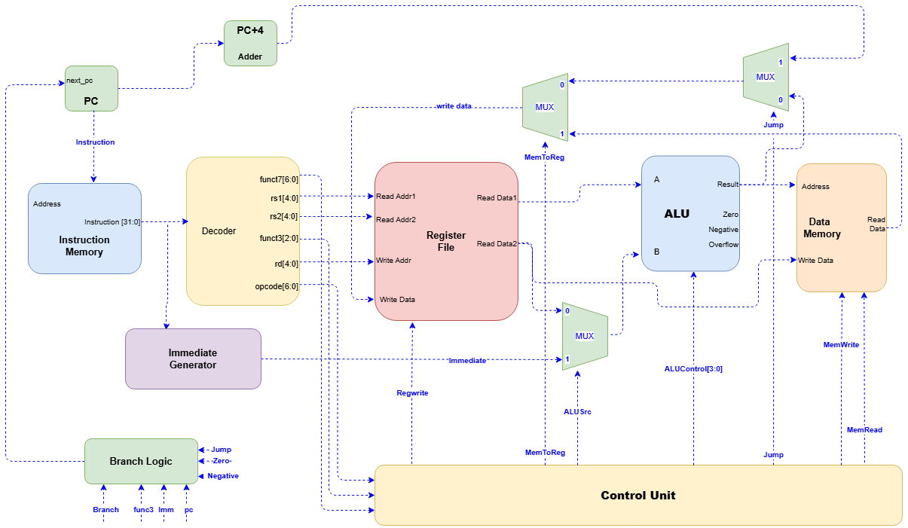

# RV32I Single-Cycle CPU

A 32-bit single-cycle RISC-V subset CPU implemented in Verilog HDL.

The project was developed from individual RTL modules through full CPU integration, with verification performed at both module and processor level.

---

## Features

### Supported Instructions

| Type   | Instructions                                     |
| ------ | ------------------------------------------------ |
| R-Type | ADD, SUB, AND, OR, XOR, SLL, SRL, SRA, SLT, SLTU |
| I-Type | ADDI, ANDI, ORI, XORI, LW                        |
| S-Type | SW                                               |
| B-Type | BEQ, BNE, BLT, BGE                               |
| J-Type | JAL                                              |

---

## Architecture



Instruction flow:

```text
Fetch
→ Decode
→ Execute
→ Memory Access
→ Writeback
```

---

## Repository Structure

```text
.
├── rtl/
├── tb/
├── Verification/
├── images/
└── README.md
```

### Quick Links

#### RTL Modules

* [RTL Overview](rtl/README.md)

#### Verification

* [ALU Verification](Verification/alu.md)
* [Register File Verification](Verification/regfile.md)
* [Control Unit Verification](Verification/cu.md)
* [Data Memory Verification](Verification/dmem.md)
* [Branch & Jump Verification](Verification/branchjump.md)
* [CPU-Level Verification](Verification/cpu.md)

---

## Verification Summary

Verification was performed using:

```text
RTL
→ Testbench
→ Simulation
→ Waveform Inspection
→ Bug Fixing
```

Tools:

```text
Icarus Verilog
VaporView VCD viewer
GTKWave
```

---

## Notable Engineering Challenges

Examples of issues discovered and resolved during development:

* Signed vs unsigned comparison behavior
* Overflow detection logic
* x0 register protection
* Store-path integration bug
* JAL writeback handling
* Address-space vs memory-index confusion

Detailed discussions and waveforms are available in the verification pages.

---

## Current Limitations

* Single-cycle architecture
* No pipelining
* No hazard handling
* RV32I subset implementation
* Word-aligned memory accesses

---

## Status

```text
CPU Core              ✓ Complete
Module Verification   ✓ Complete
CPU Integration       ✓ Complete
```
