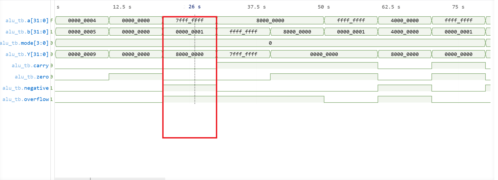
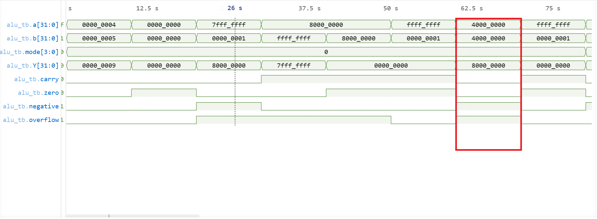
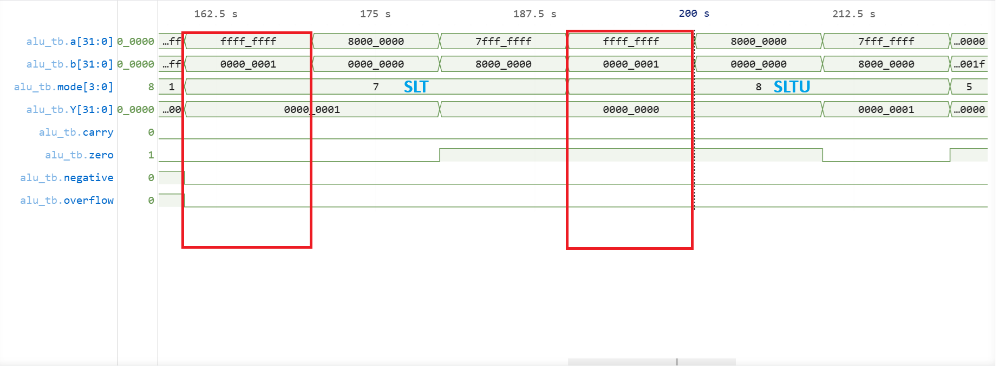
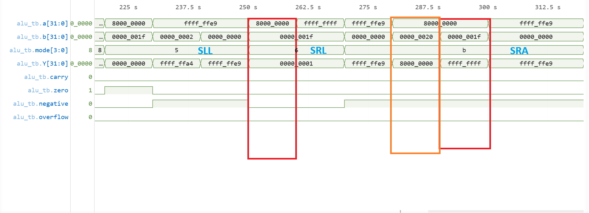

# ALU Verification

## Overview

The ALU implements arithmetic, logical, comparison, and shift operations used by the CPU datapath.

### Supported Operations

| Category   | Operations    |
| ---------- | ------------- |
| Arithmetic | ADD, SUB      |
| Logical    | AND, OR, XOR  |
| Shifts     | SLL, SRL, SRA |
| Comparison | SLT, SLTU     |

### Generated Flags

* Zero
* Negative
* Carry
* Overflow

---

## Verification Coverage

### Arithmetic

* Basic addition
* Basic subtraction
* Carry generation
* Borrow behavior
* Positive overflow
* Negative overflow

### Comparison

* Signed comparison (SLT)
* Unsigned comparison (SLTU)

### Shifts

* Logical left shift
* Logical right shift
* Arithmetic right shift
* Shift amount boundary conditions

### Flags

* Zero
* Negative
* Carry
* Overflow

All tests passed.

---

# Highlighted Results

## Addition Verification

The waveform below contains addition-related verification including:

* Normal addition
* Zero result
* Carry generation
* Signed overflow cases

Highlighted region:

```text
0x7FFFFFFF + 1
```

Expected:

```text
Result   = 0x80000000
Overflow = 1
Negative = 1
```



Result: PASS

---

## Subtraction Verification

The waveform below contains subtraction-related verification including:

* Normal subtraction
* Borrow behavior
* Zero result
* Signed overflow cases

Highlighted region:

```text
0x80000000 - 1
```

Expected:

```text
Result   = 0x7FFFFFFF
Overflow = 1
```



Result: PASS

---

## Comparison Verification

Signed and unsigned comparisons were verified independently.

Highlighted cases:

```text
SLT :  -1 < 1        -> 1
SLTU: 0xFFFFFFFF < 1 -> 0
```

This verifies correct signed and unsigned interpretation.



Result: PASS

---

## Shift Verification

The waveform below contains:

* SLL
* SRL
* SRA
* Shift boundary tests

Highlighted cases:

```text
0x80000000 >> 31                                        🔴

SRL -> 0x00000001
SRA -> 0xFFFFFFFF
```

and

```text
Shift amount = 32                                       🟠

Effective shift = 0
```

because only `b[4:0]` is used.



Result: PASS

---

# Development Notes

## Signed Comparison Issue

Initial implementation treated SLT as an unsigned comparison.

Fix:

```verilog
$signed(a) < $signed(b)
```

---

## Shift Amount Issue

Initial implementation used the full operand as the shift amount.

Fix:

```verilog
b[4:0]
```

---

## Waveform Interpretation

A subtraction result of:

```text
0xFFFFFFFF
```

was initially interpreted as:

```text
4294967295
```

The waveform was displayed as unsigned decimal.

The ALU behavior was correct; only the displayed interpretation was misleading.

---

# Conclusion

The ALU successfully passed arithmetic, comparison, shift, and flag verification.

The module is considered verified and was subsequently integrated into the CPU datapath.
