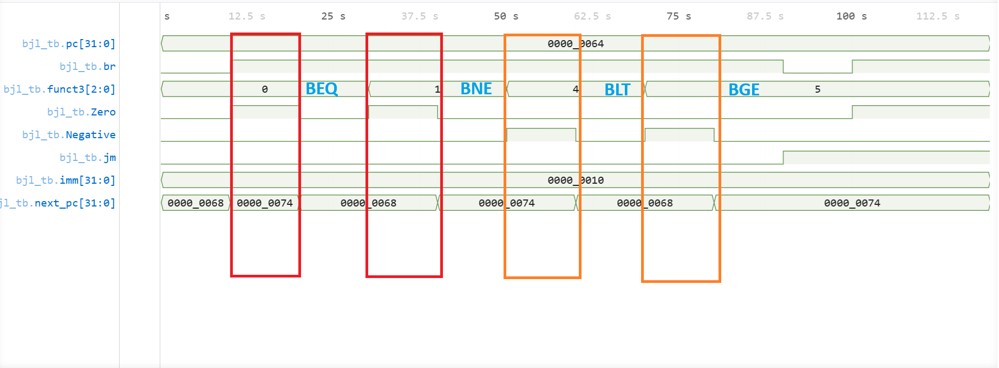
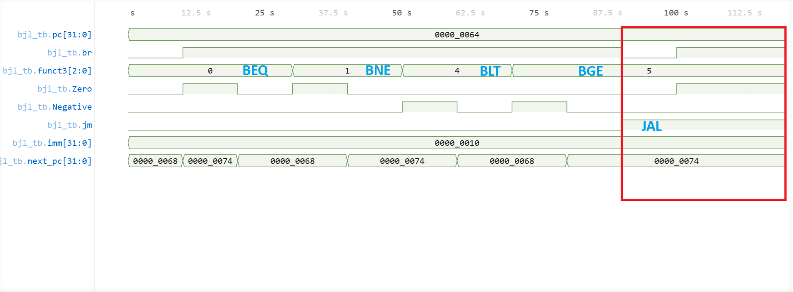

# Branch & Jump Logic Verification

## Overview

The Branch & Jump Logic (BJL) module determines the next Program Counter value based on branch and jump conditions.

Supported operations:

* BEQ
* BNE
* BLT
* BGE
* JAL
* Sequential execution (PC + 4)

All verification tests passed successfully.

---

## Branch Verification

The waveform below contains verification of all supported branch instructions.



### 🔴 — Equality-Based Branching

Verified instructions:

```text
BEQ
BNE
```

These instructions use the ALU Zero flag to determine whether a branch should be taken.

Expected:

```text
BEQ : Zero = 1 → Branch Taken
BNE : Zero = 0 → Branch Taken
```

Result: PASS

---

### 🟠 — Signed Comparison Branching

Verified instructions:

```text
BLT
BGE
```

These instructions use signed comparison results generated by the ALU.

Expected:

```text
BLT : Negative = 1 → Branch Taken
BGE : Negative = 0 → Branch Taken
```

Result: PASS

---

Additional taken and not-taken branch scenarios are present in non-highlighted regions of the waveform.

---

## Jump Verification

The waveform below contains JAL verification.



### — Unconditional Jump

Expected:

```text
next_pc = pc + imm
```

independent of branch comparison results.

Result: PASS

---

## Conclusion

The Branch & Jump Logic successfully passed equality-based branching, signed-comparison branching, jump, and control-priority verification tests.

The module was subsequently integrated into the CPU datapath.
