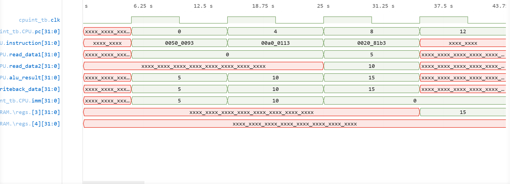
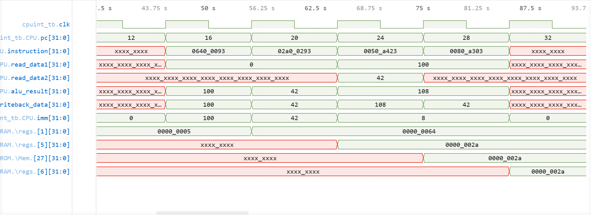
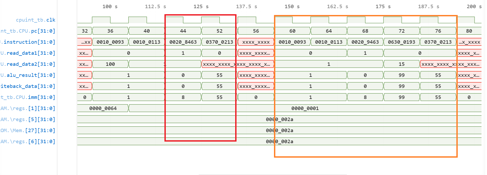
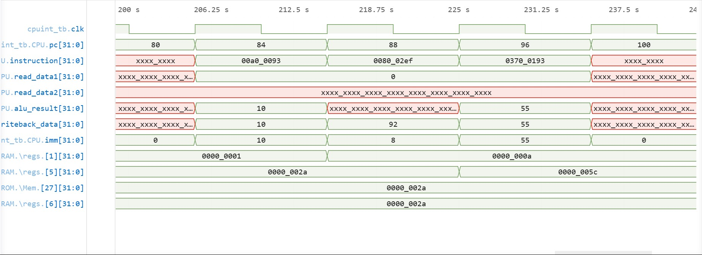
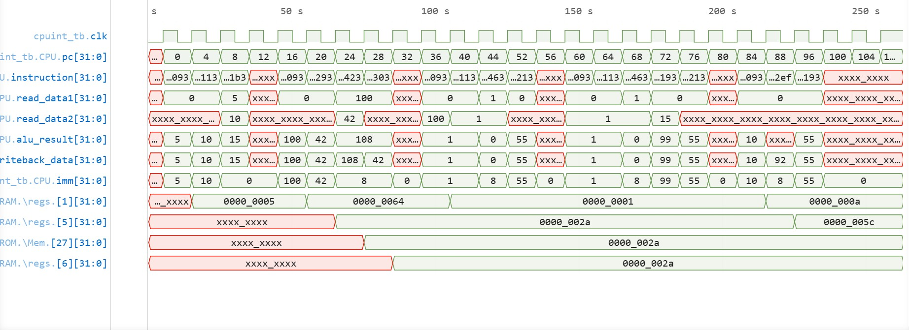

# CPU Integration Verification

## Overview

This verification validates the complete integration of the CPU datapath and control logic.

The following modules participate in the tests:

* Program Counter (PC)
* Instruction Memory
* Register File
* Immediate Generator
* Control Unit
* ALU
* Branch & Jump Logic
* Data Memory

The objective is to verify correct instruction execution rather than individual module behavior.

---

## Supported Instructions

### Arithmetic

* ADD
* SUB
* AND
* OR
* XOR
* SLL
* SRL
* SRA
* SLT
* SLTU

### Immediate

* ADDI
* XORI

### Memory

* LW
* SW

### Branch

* BEQ
* BNE
* BLT
* BGE

### Jump

* JAL

---

## Verification Coverage

Verified functionality:

* Sequential instruction execution
* Register writeback
* Immediate generation
* Arithmetic datapath operation
* Memory access
* Branch redirection
* Jump redirection
* Program Counter updates
* Control signal interaction
* End-to-end instruction execution

All integration tests passed.

---
>Note this is a cumulative testbench, i.e operations are in sequential manner, and memory is shared in all examples.
## Arithmetic Integration

The waveform below verifies arithmetic instruction execution through the complete datapath.

Example program:

```text
ADDI x1, x0, 5
ADDI x2, x0, 10
ADD  x3, x1, x2
```

Expected results:

```text
x1 = 5
x2 = 10
x3 = 15
```

Observed:

```text
ALU result = 15
Register writeback successful
```

Waveform:



Result: PASS

---

## Memory Integration

The waveform below verifies load/store functionality through the complete datapath.

Verified functionality:

```text
Address generation
Store operation
Load operation
Memory writeback
```

Example:

```text
ADDI x1, x0, 100
ADDI x5, x0, 42
SW x5, 8(x1)
LW x6, 8(x1)
```

Expected:

```text
Memory contents preserved
Loaded value equals stored value
```

Observed:

```text
Memory write successful
Memory read successful
Register writeback successful
```

Waveform:



Result: PASS

---

## Branch Verification

The waveform below verifies program-flow redirection using conditional branches.

Verified functionality:

```text
BEQ
BNE
BLT
BGE
```

### — Branch Taken and not Taken

A branch condition is satisfied and execution skips the following instruction.

Observed behavior:

```text
Instruction after branch not executed
Target instruction executed
```

This confirms correct interaction between:

```text
ALU flags
Control Unit
Branch Logic
Program Counter
```

SampleCode:
```text
ADDI x1,x0,1        //Branch Taken          🔴
ADDI x2,x0,1
BEQ  x1,x2,+8
ADDI x3,x0,99
ADDI x4,x0,55
```
```text
ADDI x1,x0,1        //Branch not taken      🟠
ADDI x2,x0,1
BNE  x1,x2,+8
ADDI x3,x0,99
ADDI x4,x0,55
```

Waveform:



Result: PASS

---

## Jump Verification

The waveform below verifies unconditional jump execution.

Verified functionality:

```text
JAL
```

###  — Program Counter Redirection

Observed behavior:

```text
PC redirected to jump target
Intermediate instruction skipped
Execution resumes at destination
```

This confirms correct interaction between:

```text
Immediate Generator
Control Unit
Branch & Jump Logic
Program Counter
```

Waveform:



Result: PASS

---

## Architectural State Verification

The integration tests additionally verify:

* Correct Program Counter progression
* Correct register updates
* Correct ALU operation selection
* Correct immediate generation
* Correct memory addressing
* Correct writeback source selection
* Correct branch decisions
* Correct jump decisions

These behaviors are visible throughout the noned regions of the waveforms.

---

## Development Notes

Several issues were discovered and corrected during CPU integration:

### Register File Read Sensitivity

Issue:

```text
Register reads were not updating after writes.
```

Cause:

```text
Incomplete sensitivity list in asynchronous read logic.
```

Resolution:

```text
Restored proper combinational read behavior.
```

---

### Data Memory Addressing

Issue:

```text
Byte addresses were incorrectly used as memory indices.
```

Resolution:

```text
Address conversion performed using word indexing.
```

---

### Immediate Generation

Issue:

```text
Incorrect sign extension during immediate reconstruction.
```

Resolution:

```text
Immediate format logic corrected and re-verified.
```

---

## Conclusion

The CPU successfully executed arithmetic, memory, branch, and jump instructions using the complete integrated datapath.

All implemented instruction classes were verified at system level.

The design is considered functionally complete for the implemented RV32I instruction subset.


### Complete waveform for reference:
