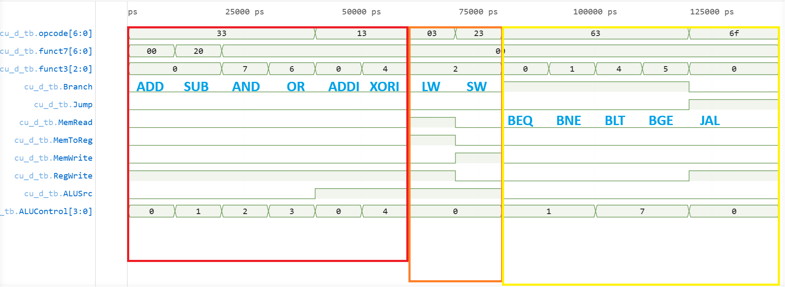

# Control Unit Verification

## Overview

The Control Unit decodes instructions and generates the control signals required by the datapath.

Implemented instruction classes:

- R-Type
- I-Type
- Load
- Store
- Branch
- Jump

All tests passed.

---

## Highlighted Results

The waveform below contains verification of all implemented instruction classes.

### 🔴 — Arithmetic Instructions

ADD, SUB, AND, and OR correctly generate register-write and ALU control signals.

### 🟠 — Memory Instructions

LW and SW correctly generate memory access signals.

### 🟡 — Control Flow Instructions

BEQ, BNE, BLT, BGE, and JAL correctly generate branch and jump control signals.

Additional instruction cases are present in non-highlighted regions of the waveform.

Result: PASS

---

## Conclusion

The Control Unit successfully generated the expected control signals for all implemented instructions and was integrated into the CPU datapath.