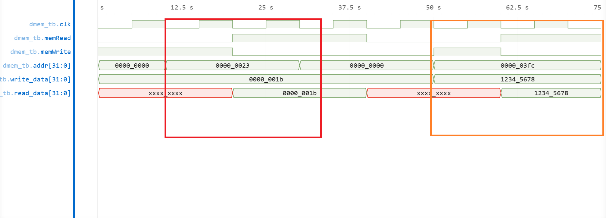

# Data Memory Verification

## Overview

The Data Memory module provides word-addressed storage for load and store operations.

### Features

* Synchronous writes
* Asynchronous reads
* Word-addressed storage
* Byte-addressed CPU interface

---

## Verification Coverage

Verified functionality:

* Memory write
* Memory read
* Read-after-write behavior
* Address-to-index conversion
* Boundary address access
* Disabled memory operation

All tests passed.

---

## Highlighted Results

### 🔴 — Read After Write

The waveform below verifies successful storage and retrieval of data.

Example:

```text
Address = 0x23
Write Data = 27
```

Expected:

```text
Read Data = 27
```

This verifies correct address translation and memory access.

---

### 🟠 — Boundary Address Access

The waveform below verifies operation at the highest valid memory location.

Example:

```text
Address = 0x3FC
Write Data = 0x12345678
```

Expected:

```text
Read Data = 0x12345678
```

This confirms correct handling of upper memory boundaries.

---



Additional read and write scenarios are present in non-highlighted regions of the waveform.

Result: PASS

---

## Development Notes

A bug was discovered during CPU integration where architectural addresses were incorrectly used as memory indices.

Fix:

```verilog
addr >> 2
```

This correctly converts byte addresses into word indices.

---

## Conclusion

The Data Memory module successfully passed read, write, address translation, and boundary verification tests and was integrated into the CPU datapath.
