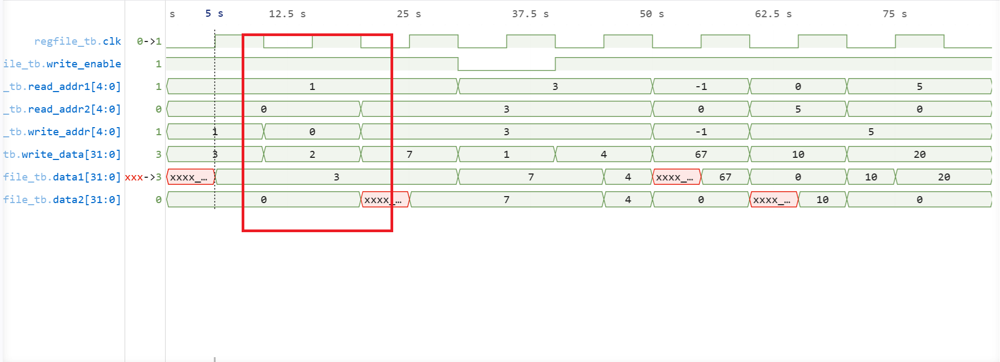
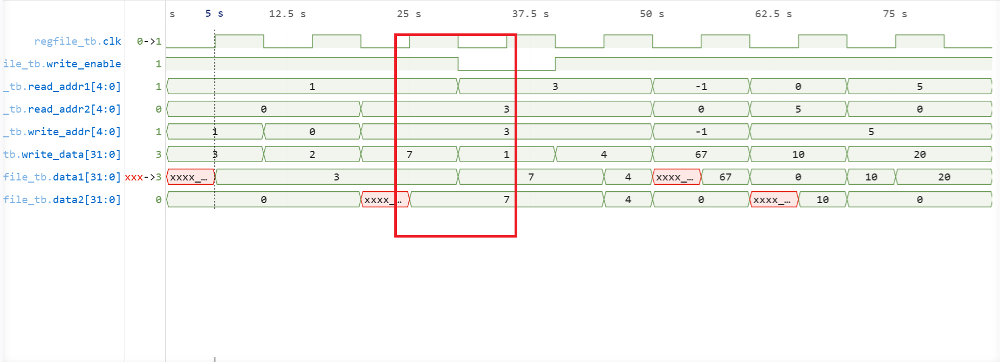
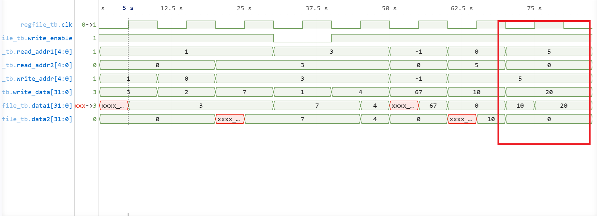

# Register File Verification

## Overview

The Register File provides architectural storage for the CPU.

### Features

* 32 Registers
* 32-bit Width
* 2 Read Ports
* 1 Write Port
* Asynchronous Read
* Synchronous Write

Special behavior:

```text
x0 = 0
```

Writes to x0 are ignored.

---
> Note: the waveform is in decimal(signed) for ease of access

## Verification Coverage

Verified functionality:

* Register writes
* Register reads
* Dual-port reads
* Read-after-write behavior
* Write disable behavior
* x0 protection
* Register overwrite behavior
* Highest register access (x31)

All tests passed.

---

## Highlighted Results

### x0 Protection

The waveform below verifies that writes to x0 are ignored.

Expected:

```text
x0 always remains 0
```



Result: PASS

---

### Dual-Port Read

The waveform below verifies simultaneous access through both read ports.

Expected:

```text
Read Port A and Read Port B operate independently.
```



Result: PASS

---

### Read-After-Write / Register Update

The waveform below verifies register updates and subsequent reads.

Highlighted cases:

```text
R1 <- 3
R3 <- 7
R5 <- 10
R5 <- 20
```

Expected:

```text
Latest written value is observed.
```



Result: PASS

---

## Development Notes

### x0 Handling

The register file implements the RISC-V architectural rule:

```text
x0 = 0
```

Writes targeting x0 are discarded.

### Read Behavior

Reads are asynchronous and reflect the current register contents without requiring a clock edge.

### Write Behavior

Writes occur only on the active clock edge when write_enable is asserted.

---

## Conclusion

The Register File successfully passed read, write, dual-read, overwrite, and x0 protection verification.

The module was subsequently integrated into the CPU datapath.
