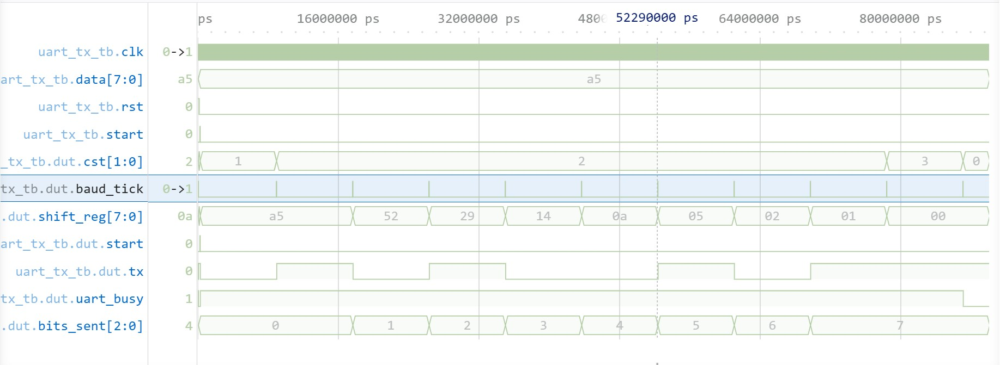

# UART Transmitter Verification

## Overview

The UART Transmitter serializes an 8-bit parallel input into a UART frame using a configurable baud rate.

Implemented features:

- Configurable clock frequency
- Configurable baud rate
- Start bit generation
- 8-bit data transmission (LSB first)
- Stop bit generation
- UART busy indication

All tests passed.

---

## Testbench

The verification testbench performs a single transmission of:

```verilog
data = 8'hA5;
```

The `start` signal is asserted for one clock cycle to initiate transmission.

Expected UART frame:

```
Idle  : 1
Start : 0
Data  : 1 0 1 0 0 1 0 1   (LSB first)
Stop  : 1
```

Each transmitted bit remains on the TX line for one baud period.

---

## Highlighted Results

The waveform below verifies the complete UART transmission.



### 🔴 — Start Bit

The transmitter drives the TX line low for exactly one baud period.

### 🟠 — Data Transmission

The input byte is shifted out LSB first.

The waveform confirms:

- Correct bit order
- One shift per baud tick
- Eight transmitted data bits

### 🟡 — Stop Bit

After the final data bit, the transmitter drives TX high for one baud period before returning to the IDLE state.

### 🟢 — Status Signals

The `uart_busy` signal remains asserted throughout the transmission and deasserts once the stop bit has completed.

Result: PASS

---

## Conclusion

The UART Transmitter successfully generated a complete UART frame consisting of one start bit, eight data bits, and one stop bit while maintaining the configured baud timing. The module is fully integrated with the CPU for serial data transmission.